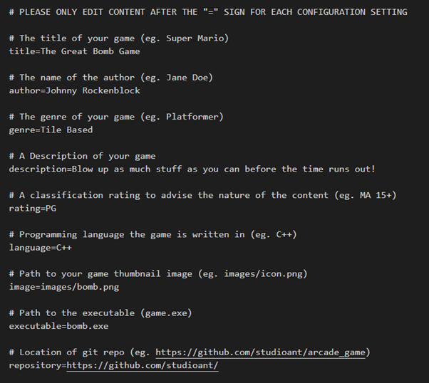
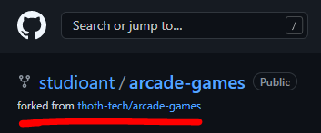

# Guide to Contribute a Game to the Arcade Machine 

This guide takes you through the steps required for your game to be added into the arcade-machine
library 

---

Table of contents

- [Guide to Contribute a Game to the Arcade Machine](#guide-to-contribute-a-game-to-the-arcade-machine)
  - [Coding](#coding)
    - [Quit Request](#quit-request)
    - [Window Size](#window-size)
    - [Window Border](#window-border)
    - [Resources](#resources)
    - [Other](#other)
  - [Controls](#controls)
    - [Player One](#player-one)
    - [Player Two](#player-two)
    - [General](#general)
  - [Compiling](#compiling)
  - [Artwork](#artwork)
  - [Configuration](#configuration)
  - [Content](#content)
  - [Contributing](#contributing)

---

## Coding

To make the game accessible and controllable by the arcade machine, some additional code or changes
are required.

### Quit Request

Your game must be able to be exited using the escape key This can be achieved by including the
following command in your main loop.

```cpp
int main()
{
    while(!key_down(ESCAPE_KEY))
    {
        // game play
    }
}
```

### Window Size

The window size of your game cannot exceed 1600 x 900, this is to allow your game to sit neatly
inside the arcade-machine itself. Similarly, there is a minimum window size of 640 x 480, to ensure
visibility for the user.

The window size of your game cannot exceed 1600 x 900, this is to allow your game to sit neatly
inside the arcade-machine itself. Similarly, but mainly for aesthetic purposes, a minimum window
size of 640 x 480 is expected.

### Window Border

We ask that you remove the border before compiling your game. The Arcade Machine provides a more
immersive experience for the user if there is no border. To remove the border of your game window,
use SplashKit’s `window_toggle_border();` function after the `open_window()` function like so:

```cpp
int main()
{
    open_window("my-game", width, height);
    window_toggle_border("my-game");
}
```

### Resources

SplashKit locates the resources directory in different places for different operating systems.
To ensure your resources are located correctly, please include the following in your program.cpp file:  

```cpp
#ifdef _WIN32
#define PATH_SEP "\\"
#else
#define PATH_SEP "/"
#endif
```

Then in main:

```cpp
int main()
{
    // other code...

    // before get resource bundle
    set_resources_path("Resources", PATH_SEP);
}
```

### Other

To ensure the arcade machine can retrieve files using path information, please refrain from adding whitespace to any file path.
**Example:**
Use `my-game` instead of `my game`.. etc.

## Controls

The following keys are required to be the functional keys of your game to be compatible with the arcade machine.  

### Player One

Up: `W` | Left: `A` | Down `S` | Right: `D`
Weak(1): `R` | Weak(2): `F`
Med(1) : `T` | Med(2) : `G`
Hard(1): `Y` | Hard(2): `H`

### Player Two

Up: `UP_ARROW` | Left: `LEFT_ARROW` | Down: `DOWN_ARROW` | Right: `RIGHT_ARROW`
Weak(1): `U` | Weak(2): `J`
Med(1) : `I` | Med(2) : `K`
Hard(1): `O` | Hard(2): `L`

### General

Start: `ENTER`
Escape: `ESC`

## Compiling

The compiling of your game is handled automatically through GitHub actions.
Your game will be compiled into executables compatible with Windows, Linux and MacOS operating systems.  
**Please ensure all program files (.h and .cpp) are provided in your pull request**  

## Artwork

A preview of your game will be shown in the Arcade Machine games menu. Please include an image of
your game.  
This image must be sized as 600px x 540px so it will be displayed correctly in the games menu.  
The supported formats are png, jpg and bmp.

If you don’t have access to image editing software such as Adobe Illustrator/Photoshop etc, we
suggest you use a browser-based tool such as [resizeimage](https://resizeimage.net/) to resize, crop
or format a screenshot of your game.

## Configuration

Each game must have a config file containing information about the game.  
There is a `config.txt` file located in the base directory of the repository, copy this file into
the base directory of your game file and fill it with your game information. It must match the
example config file shown below, but with your game information.



The configuration file **must** be in text (`.txt`) format, and it must be named `config.txt`.  
This must be located in your games root directory, alongside your `program.cpp` (example below)


## Content

(TBA - explanation of content requirements)

## Contributing

Congratulations!

You have now completed all the steps required to have your game showcased on the Arcade Machine.

To contribute your game, go to the
[Thoth Tech arcade-games repository](https://github.com/thoth-tech/arcade-games)  
Click the ‘_Fork_’ button at the top right of the screen and create a fork of this repository.


You will now have the arcade-games repository in your personal Git.



On your local, navigate to a desired file path and clone this repository using the bash command:

```git
git clone https://github.com/<your-git-username>/arcade-games.git
```

Add your game to the directory and stage a commit to the remote repo:

```git
git add .
```

In your commit message, include your name and the name of the game:

```git

git commit -m ”Anthony George - Venture Adventure”
git push
```

You will now see your game in the remote fork.


Now create a Pull request to have your game added to the arcade-machine.

Click the ‘_Pull requests_’ tab, then click ‘_New pull request_’ button, then click '_Create pull
request_'


Write a message for the Arcade Machine and hit '_Create pull request_'


You will see that merging is blocked until a member of the Arcade-Machine team has reviewed your
game.  
 We will be sure to get in contact with you once it has been approved!


